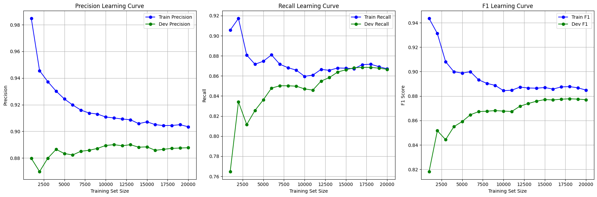
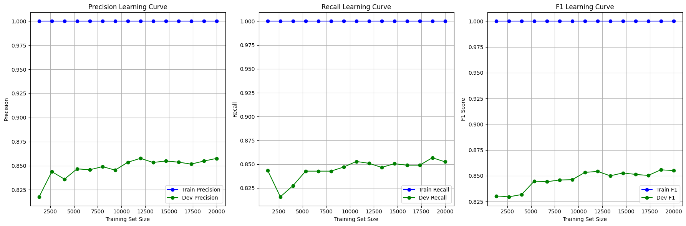
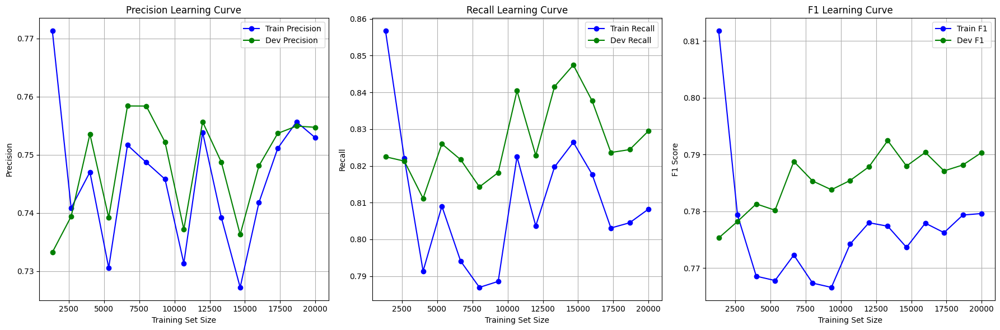
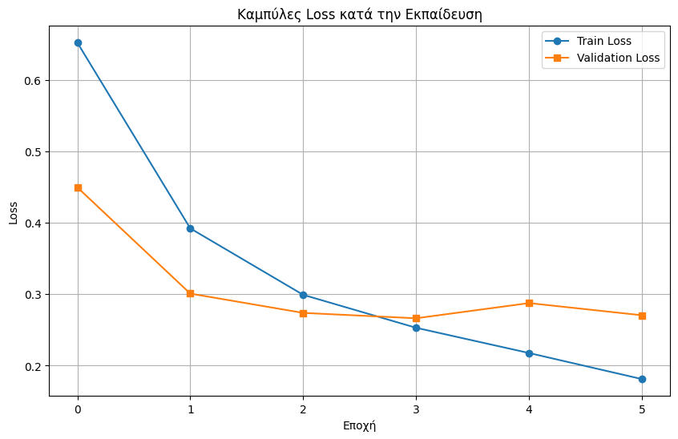
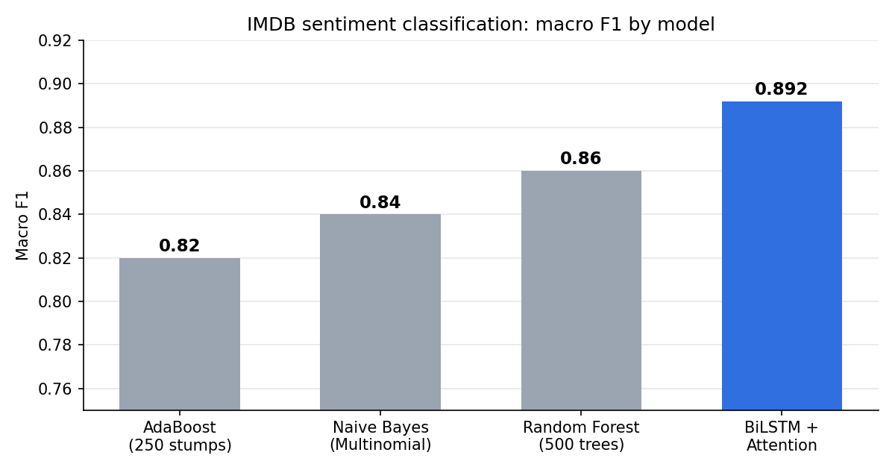
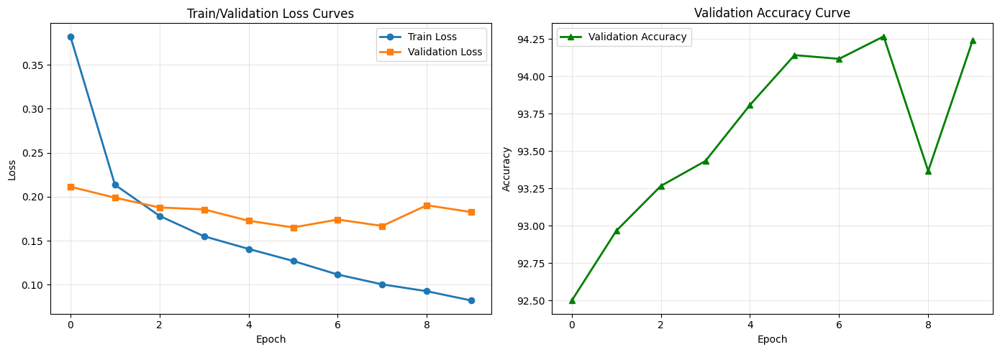

# Sentiment Analysis & Image Classification: From Classical ML to Deep Learning

Three end-to-end machine learning pipelines covering two tasks:

1. **Text classification:** classifying IMDB movie reviews as positive or negative, comparing classical classifiers built on hand-engineered features against a deep **stacked BiLSTM with attention**.
2. **Image classification:** classifying Fashion-MNIST clothing images by fine-tuning a pre-trained **ResNet-18**.

| Notebook | Task | Approach | Result | Run |
|---|---|---|---|:---:|
| [`01_imdb_classical_classifiers`](notebooks/01_imdb_classical_classifiers.ipynb) | IMDB sentiment | Information Gain features + Naive Bayes / Random Forest / AdaBoost | up to **86%** accuracy | [](https://colab.research.google.com/github/bniko05/sentiment-and-image-classification/blob/main/notebooks/01_imdb_classical_classifiers.ipynb) |
| [`02_imdb_bilstm_attention`](notebooks/02_imdb_bilstm_attention.ipynb) | IMDB sentiment | 3-layer BiLSTM + GloVe + self-attention | **89.2%** accuracy | [](https://colab.research.google.com/github/bniko05/sentiment-and-image-classification/blob/main/notebooks/02_imdb_bilstm_attention.ipynb) |
| [`03_fashionmnist_resnet18`](notebooks/03_fashionmnist_resnet18.ipynb) | Fashion-MNIST | Fine-tuned ResNet-18 + MLP head | **94.3%** accuracy | [](https://colab.research.google.com/github/bniko05/sentiment-and-image-classification/blob/main/notebooks/03_fashionmnist_resnet18.ipynb) |

All notebooks include their saved outputs, so results and plots can be viewed directly on GitHub without running anything.

---

## How to run

Click an **Open in Colab** badge above and choose **Runtime → Run all**. Datasets and pre-trained weights are downloaded automatically.

- Notebook 01 runs on the default CPU runtime.
- Notebooks 02 and 03 need a GPU: **Runtime → Change runtime type → T4 GPU**.
- 
---

## IMDB sentiment: classical classifiers

**Dataset:** 50,000 IMDB reviews (25,000 train / 25,000 test), balanced between positive and negative.

### Feature engineering
1. Built a vocabulary from word document frequencies, discarding the **20 most frequent** words (mostly stop-words) and the **50,000 rarest**. The cutoff of 20 was tuned so that the word *"not"*, which is crucial for sentiment, stays in the vocabulary.
2. Represented each review as a **binary vector** (1 if a word appears in the review, 0 otherwise).
3. Implemented **Information Gain** from scratch and kept the **8,000 most informative words** out of ~30,000 remaining.

### Models
| Model | Configuration |
|---|---|
| Naive Bayes | `MultinomialNB` on binary features |
| Random Forest | 500 trees, `criterion='entropy'` (ID3-style splits) |
| AdaBoost | 250 decision stumps (`max_depth=1`) |

Learning curves (precision, recall and F1 on train vs. development sets as training size grows) were computed with a from-scratch metrics implementation:



<details>
<summary>Random Forest and AdaBoost learning curves</summary>




</details>

The Random Forest fits the training set perfectly (train F1 = 1.0) yet still generalizes best among the classical models. Naive Bayes shows the textbook pattern of train and development curves converging as data grows.

---

## IMDB sentiment: stacked BiLSTM with attention

### Architecture
```
Embedding (GloVe 200d, fine-tuned)
   → Dropout(0.5)
   → 3-layer Bidirectional LSTM (hidden size 192)
   → Self-attention MLP (Linear → Tanh → Linear → Softmax over time steps)
   → Weighted sum of LSTM states → Dropout(0.5) → Linear → Sigmoid
```

The attention layer learns a weight for every word position, so the prediction is driven by the most sentiment-bearing words rather than only the final hidden state.

### Training setup
| Setting | Value |
|---|---|
| Vocabulary | 15,000 most frequent words |
| Sequence length | 400 tokens (padded / truncated) |
| Split | 80% train / 10% validation / 10% test |
| Optimizer | Adam, lr = 5e-4 |
| Loss | Binary cross-entropy |
| Batch size | 64 |
| Early stopping | patience 2 on validation loss (max 15 epochs) |



Validation loss bottomed out at epoch 4, and early stopping ended training at epoch 6. The best checkpoint was restored for evaluation.

### Results
| Class | Precision | Recall | F1 |
|---|:---:|:---:|:---:|
| Positive | 0.881 | 0.911 | 0.896 |
| Negative | 0.905 | 0.873 | 0.889 |
| **Macro avg** | **0.893** | **0.892** | **0.892** |

### Model comparison



The BiLSTM outperforms every classical model. Word embeddings capture semantic similarity, and the recurrent layers model word order and context (e.g. negation), which a bag-of-words representation cannot.

> **Note:** the classical models were evaluated on the official 25,000-review test set, while the BiLSTM was evaluated on a held-out 10% split, so the comparison is indicative rather than exact.

---

## Fashion-MNIST: fine-tuned ResNet-18

**Dataset:** 70,000 grayscale 28×28 images of clothing across 10 classes (48,000 train / 12,000 validation / 10,000 test).

### Approach
- **Transfer learning:** an ImageNet-pre-trained ResNet-18, with the final layer replaced by an MLP head (512 → 256 → ReLU → Dropout(0.5) → 10).
- **Preprocessing:** images converted to 3 channels, resized to 224×224 and normalized with ImageNet statistics to match the pre-trained weights.
- **Augmentation:** random rotation (±10°) and horizontal flips.
- **Training:** Adam (lr = 1e-4, weight decay = 1e-4), cross-entropy loss, batch size 64, up to 10 epochs, keeping the checkpoint with the best validation accuracy (early-stopping patience 3).



### Results (test set, 10,000 images)
**Accuracy: 94.3% · Macro F1: 0.943**

| Class | Precision | Recall | F1 |
|---|:---:|:---:|:---:|
| T-shirt/top | 0.893 | 0.897 | 0.895 |
| Trouser | 0.997 | 0.988 | 0.993 |
| Pullover | 0.929 | 0.909 | 0.919 |
| Dress | 0.920 | 0.965 | 0.942 |
| Coat | 0.926 | 0.918 | 0.922 |
| Sandal | 0.980 | 0.998 | 0.989 |
| Shirt | 0.837 | 0.819 | 0.828 |
| Sneaker | 0.980 | 0.964 | 0.972 |
| Bag | 0.991 | 0.996 | 0.994 |
| Ankle boot | 0.976 | 0.976 | 0.976 |

Most classes exceed 0.97 F1. The hardest classes are **Shirt** and **T-shirt/top**, which look very similar to each other and to pullovers and coats at this resolution.

---

## Repository structure

```
├── notebooks/
│   ├── 01_imdb_classical_classifiers.ipynb
│   ├── 02_imdb_bilstm_attention.ipynb
│   └── 03_fashionmnist_resnet18.ipynb
├── docs/
│   ├── images/          # plots used in this README
│   └── report_el.pdf    # full project report (in Greek)
├── requirements.txt
└── README.md
```

---

## Authors

Developed as an assignment for the **Artificial Intelligence** course (2025), Department of Informatics, Athens University of Economics and Business.

- **Vasileios Nikolaou** ([@bniko05](https://github.com/bniko05))
- **Giorgos Papachristos**
- **Efthymis Popolis**
